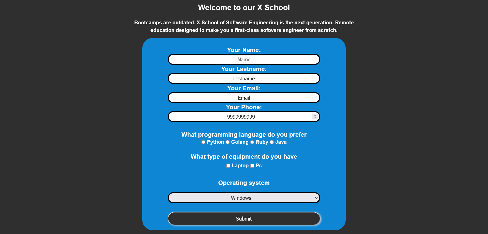

# Contact Form

## Table of contents

- [Overview](#overview)
  - [The challenge](#the-challenge)
  - [Links](#links)
- [My process](#my-process)
  - [Built with](#built-with)
  - [What I learned](#what-i-learned)
  - [Continued development](#continued-development)
  - [Useful resources](#useful-resources)
- [Author](#author)

## Overview

### The challenge
A coding school ask me to create a contact page to take leads from that. 

### Links

- Solution URL: (https://github.com/stathislag/contactForm)
- Live Site URL: (https://stathislag.github.io/contactForm/)

## My process

### Built with

- HTML5 
- CSS 
- Flexbox
- Media Queries

### What I learned

Some of my major learnings while working through this project. Was stracture my project in Html,Css learn new properties around css like margin, 
classes, media queries, form template and much more. New consepts in the future is how to write Vanilla Javascript projects.

### Continued development

In future projects i would like to learn more consepts about Css Framework like Scss and try out new techniques with Javascript.

### Useful resources
This helped me with the building process and answered all my questions:
- [Resource 1](https://developer.mozilla.org/).
- [Resource 2](https://www.w3schools.com/).
- [Resource 3](https://www.youtube.com).
- [Resource 4](https://www.stackoverflow.com).
- [Resource 5](https://www.freecodecamp.org).

## Author

- Website - [Stathis](https://github.com/stathislag)

